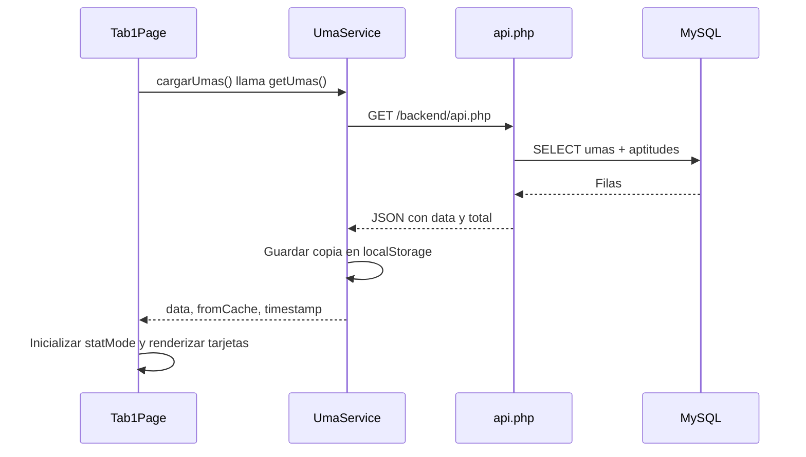

# API: endpoints y consumo desde Ionic/Angular

Esta guía describe el código actual del proyecto. El backend está implementado en **PHP con PDO y MySQL** y el frontend hace peticiones con **Axios**. Las rutas de Express mencionadas en el README original corresponden al planteamiento inicial, no a los endpoints actuales.

## 1. Dónde está cada pieza

| Archivo | Responsabilidad |
| --- | --- |
| [backend/api.php](../backend/api.php) | Listado, detalle y compatibilidad de Umas; transformación de filas SQL a JSON. |
| [backend/login.php](../backend/login.php) | Verificación de correo y contraseña. |
| [backend/signup.php](../backend/signup.php) | Creación de usuarios. |
| [backend/formulario-contacto.php](../backend/formulario-contacto.php) | Guardado de mensajes de contacto. |
| [backend/db_config.php](../backend/db_config.php) | Conexión PDO, encabezados JSON/CORS y respuesta a OPTIONS. |
| [api.config.ts](../src/app/services/api.config.ts) | URL base compartida por el frontend. |
| [uma.service.ts](../src/app/services/uma.service.ts) | Consulta del catálogo y caché local. |
| [uma.model.ts](../src/app/models/uma.model.ts) | Interfaces TypeScript de Umas y respuestas. |
| [tab1.page.ts](../src/app/tab1/tab1.page.ts) | Carga de Umas y elección de estadísticas. |
| [tab1.page.html](../src/app/tab1/tab1.page.html) | Presentación de los datos en tarjetas. |
| [login.page.ts](../src/app/login/login.page.ts) | Llamadas de inicio de sesión y registro. |
| [tab2.page.ts](../src/app/tab2/tab2.page.ts) | Envío de contacto y reintento de mensajes pendientes. |
| [auth.service.ts](../src/app/services/auth.service.ts) | Lectura del usuario local y cierre de sesión local. |

## 2. URL base y conexión

En `src/app/services/api.config.ts`:

```ts
export const SERVER_PORT = '8088';

export function getApiBaseUrl(): string {
  return `http://localhost:${SERVER_PORT}/backend`;
}
```

Por ejemplo, el catálogo se consulta en `http://localhost:8088/backend/api.php`. Apache debe servir la carpeta PHP bajo `/backend`. El servidor de desarrollo de Ionic sirve el frontend; no ejecuta los archivos PHP.

En Android conectado por USB, la configuración está pensada para usar:

```sh
adb reverse tcp:8088 tcp:8088
```

Esto dirige el puerto 8088 del dispositivo al puerto 8088 de la computadora. Sin esa redirección, `localhost` en el teléfono apunta al propio teléfono. Para otra dirección de servidor, se cambia `getApiBaseUrl()`; actualmente no selecciona una URL distinta según la plataforma.

`db_config.php` configura MySQL en el puerto **3307**, con la base `app_db`. Ese puerto es distinto al **8088** de HTTP. Las credenciales pertenecen al backend y no se envían desde Angular.

## 3. Endpoints disponibles

Las rutas de esta tabla son relativas a `http://localhost:8088/backend`.

| Método | Ruta | Entrada | Respuesta correcta | Consumo actual |
| --- | --- | --- | --- | --- |
| GET | `/api.php` | Sin parámetros; `action=umas` es opcional. | 200: `{ status, total, data: Uma[] }` | `UmaService.getUmas()` |
| GET | `/api.php?id=1` | `id` de la Uma. | 200: `{ status, data: Uma }` | Todavía sin llamada desde la interfaz. |
| GET | `/api.php?action=compatibility&id=1` | `id` de la Uma de origen. | 200: `{ status, data: [...] }` | Todavía sin llamada desde la interfaz. |
| POST | `/login.php` | JSON con `email`, `password`. | 200: `{ status, message, user }` | `LoginPage.onSignIn()` |
| POST | `/signup.php` | JSON con `name`, `email`, `password`. | 201: `{ status, message, user }` | `LoginPage.onSignUp()` |
| POST | `/formulario-contacto.php` | JSON con `nombre`, `apellido`, `email`, `mensaje`. | 201: `{ status, message, id }` | `Tab2Page.onSubmit()` y `syncPendingMessages()` |

El backend devuelve `status: "success"` o `status: "error"`. Los endpoints de autenticación devuelven el usuario en **`user`**, mientras que el catálogo usa **`data`**.

### Catálogo y detalle

`api.php` consulta `umas` y hace un `LEFT JOIN` con `aptitudes`. La función `formatUma()` convierte cada registro a este contrato:

| Campo JSON | Origen / contenido |
| --- | --- |
| `id` | `umas.id`, convertido a entero. |
| `name` | `nombre`. |
| `rarity` | `rareza_base`, convertido a entero. |
| `imageUrl` | URL de imagen; las rutas relativas se completan con `/backend/public/images/`. |
| `baseStats` | Objeto con `speed`, `stamina`, `power`, `guts`, `wit`, a partir de `base_*`. |
| `maxStats` | Las mismas cinco propiedades, a partir de `max_*`; admite `null` si falta el valor. |
| `growthRates` | Las mismas cinco propiedades, a partir de `growth_*`. |
| `aptitudes` | `turf`, `dirt`, `short`, `mile`, `medium`, `long`, `front`, `leader`, `betweener`, `chaser`; usa `G` cuando el dato no existe o es nulo. |

El listado devuelve un arreglo y `total`. El detalle devuelve un objeto, no un arreglo. Un listado vacío devuelve `data: []`; un detalle inexistente responde 404.

### Compatibilidad

Consulta `afinidad_herencia`, une la Uma objetivo de cada relación y ordena por `puntos_compatibilidad` de mayor a menor. Cada elemento contiene:

```ts
{
  id: number;
  nombre: string;
  imagen_url: string;
  puntos_compatibilidad: number;
}
```

Este endpoint no usa `formatUma()`: sus nombres de propiedades son distintos del catálogo. Sin `id` responde 400; sin coincidencias devuelve un arreglo vacío con 200. Los tipos numéricos de estas filas no se convierten explícitamente en PHP y pueden depender del driver PDO.

### Inicio de sesión y registro

Ambos reciben JSON con `Content-Type: application/json`. `login.php` busca al usuario por correo y usa `password_verify()`. Devuelve `user` con `id`, `name` y `email`, sin el hash de contraseña.

`signup.php` valida los campos requeridos y el formato del correo, comprueba duplicados y almacena la contraseña mediante `password_hash()`. El registro devuelve un usuario, pero la pantalla vuelve al formulario de login para que se inicie sesión. El ID del registro proviene de `lastInsertId()` y puede llegar como cadena.

### Contacto

El formulario manda `nombre`, `apellido`, `email` y `mensaje`. El PHP admite JSON y también `$_POST`; exige que los cuatro campos tengan contenido, crea `contactos` si no existe e inserta el mensaje. Guarda el contacto en MySQL; no hay envío de correo implementado en ese archivo.

Aunque se consume mediante POST, `formulario-contacto.php` no incluye una restricción explícita de método como login y registro. Atiende OPTIONS por separado.

## 4. Cómo se consume el catálogo



1. `Tab1Page.ngOnInit()` llama a `cargarUmas()`.
2. `cargarUmas()` activa el indicador de carga y espera `UmaService.getUmas()`.
3. El servicio tiene una instancia creada con `axios.create()`, URL base compartida, timeout de **8000 ms** y encabezados JSON.
4. Ejecuta esta llamada:

```ts
const response = await this.api.get<ApiResponse<Uma[]>>('/api.php');
const umas = response.data.data;
```

`response.data` es el cuerpo JSON que entrega Axios. El segundo `.data` es la propiedad del contrato PHP que contiene el arreglo de Umas. El tipo `ApiResponse<Uma[]>` ayuda al compilador; no valida el JSON en tiempo de ejecución.

5. Si la respuesta tiene éxito y contiene datos válidos, el servicio guarda un registro `{ version: 1, data, timestamp }` en `offline_cached_umas` dentro de `localStorage`. La lectura sigue admitiendo el formato anterior con fecha separada.
6. La página recibe `{ data, fromCache, timestamp }` y prepara cada tarjeta:

```ts
this.umas = result.data.map(uma => ({
  ...uma,
  rareza_base: uma.rareza_base ?? uma.rarity,
  statMode: 'base'
}));
```

7. El HTML recorre `umas` con `*ngFor` y enlaza nombre, imagen, estadísticas, crecimiento y aptitudes.

### Alternador de estadísticas

El selector cambia `uma.statMode` entre `'base'` y `'max'`. **Alternar no hace otra petición HTTP**: ambos juegos de estadísticas ya vienen en la respuesta del catálogo.

`getStat()` lee primero `base_speed`, etc., o `max_speed`, etc., si existieran como campos sueltos. Como el PHP actual los agrupa, utiliza `baseStats[stat]` y `maxStats[stat]` como alternativa. Si no hay valor, devuelve `null` y la tarjeta muestra `—`.

El primer botón usa `rareza_base`, normalizada desde `rarity` cuando hace falta. El segundo muestra siempre `5★`. Cada nueva carga del catálogo inicializa las tarjetas en `'base'`.

### Caché y actualización

El servicio intenta primero la red cuando el dispositivo indica que está disponible. Si falta red o falla la petición y existe una copia válida (incluso vacía), devuelve esa copia con `fromCache: true`. Sin caché válida, la página muestra el error y permite reintentar. Una respuesta inválida no reemplaza la caché; un fallo al guardar no impide mostrar los datos recibidos, pero se informa al usuario.

El botón Actualizar, el gesto de arrastrar y el evento `online` vuelven a cargar el catálogo. La fecha de caché es local, no un timestamp enviado por el servidor. El manejo actual también puede recurrir a la caché ante errores HTTP, no solo cuando falta conexión.

## 5. Cómo se consumen login, registro y contacto

Las pantallas usan `axios.post()` directamente, sin pasar por `UmaService`:

```ts
// LoginPage.onSignIn(): timeout de 10000 ms
const response = await axios.post(
  `${this.apiUrl}/login.php`,
  this.signInData,
  { headers: { 'Content-Type': 'application/json' }, timeout: 10000 }
);
```

Login y registro usan **10 segundos** de timeout. Los errores HTTP se leen desde `error.response.data.message`; el código también trata el agotamiento del tiempo de espera.

Después del login, la pantalla guarda `response.data.user` en `localStorage`, bajo `currentUser`, y navega a `/tabs/tab1`. `authGuard` comprueba la existencia de esa clave. En la implementación actual no se emite un JWT ni se crea una sesión de servidor; tampoco se envía un token Authorization en estas llamadas. El guard controla la navegación del frontend, no la autorización de los endpoints PHP.

Contacto usa **6000 ms** de timeout. Si el dispositivo informa que no hay conexión, guarda el mensaje en `offline_pending_contact_messages` con una fecha local y vacía el formulario únicamente después del guardado. Los errores al enviar con red conservan el formulario y muestran un mensaje; no se encolan automáticamente.

`syncPendingMessages()` intenta enviar los pendientes al iniciar Contacto o recibir `online`, sin peticiones simultáneas. Antes del POST marca el mensaje con `needsReview`; solo lo elimina si la respuesta confirma `status: success`. Si hay un fallo o se cierra la app, no repite automáticamente el envío ambiguo. El usuario puede verificarlo y pulsar «Reintentar pendientes». El backend no dispone de claves de idempotencia: un reintento manual después de perder una respuesta podría duplicar un mensaje.

La estrategia, bitácora y prueba sin conexión se documentan en [OFFLINE.md](OFFLINE.md).

`AuthService.logout()` elimina `currentUser` localmente: no llama a un endpoint de logout. La edición de nombre y el borrado de caché en `Tab3Page` también son operaciones locales; no actualizan MySQL.

Aunque `AppModule` configura `provideHttpClient()`, las llamadas de API descritas aquí usan Axios. No hay interceptores de Axios implementados en estos archivos.

## 6. Errores HTTP implementados

| Código | Casos |
| --- | --- |
| 400 | Campos obligatorios ausentes; correo inválido en registro; compatibilidad sin ID. |
| 401 | Credenciales incorrectas en login. |
| 404 | Detalle de Uma no encontrado. |
| 405 | Método no admitido en `api.php`, `login.php` o `signup.php`. |
| 409 | Correo ya registrado. |
| 500 | Error de conexión, consulta o guardado en MySQL. |

Los errores normalmente incluyen `{ "status": "error", "message": "..." }`. Los archivos PHP configuran CORS y permiten la solicitud previa OPTIONS, que devuelve 200 sin cuerpo.

## 7. Consultas manuales de lectura

Con Apache y MySQL activos, desde PowerShell:

```powershell
# Listado
Invoke-RestMethod -Uri 'http://localhost:8088/backend/api.php' -Method Get

# Detalle (usar un ID existente)
Invoke-RestMethod -Uri 'http://localhost:8088/backend/api.php?id=1' -Method Get

# Compatibilidad
Invoke-RestMethod -Uri 'http://localhost:8088/backend/api.php?action=compatibility&id=1' -Method Get
```

Para probar login, registro o contacto en un cliente HTTP, seleccionar POST, usar la ruta de la tabla y enviar un cuerpo JSON con los campos indicados. Registro y contacto escriben datos en MySQL.

Si no aparecen estadísticas de 5★, revisar `data[i].maxStats` en la respuesta del listado y actualizar el catálogo con conexión para reemplazar una caché antigua. Si la API no responde, comprobar primero la URL base, el puerto de Apache y, en Android por USB, la redirección de ADB.

Esta documentación se verificó contra los archivos del repositorio; no implica que se hayan ejecutado peticiones contra el servidor desplegado.
